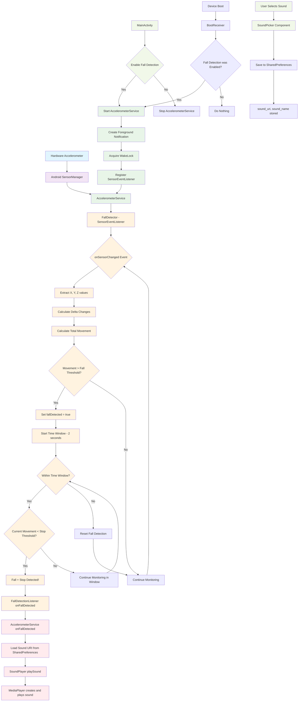

# Accelerometer Data Flow in Wasted App

## Data Flow Summary

### 1. **Sensor Data Collection**
- Hardware accelerometer provides continuous X, Y, Z acceleration values
- Android SensorManager delivers sensor events at ~50Hz (SENSOR_DELAY_GAME)
- AccelerometerService runs as a foreground service to maintain background operation

### 2. **Fall Detection Algorithm**
- **FallDetector** processes each sensor event in `onSensorChanged()`
- Calculates movement delta between consecutive readings
- Uses two-stage detection:
  - **Stage 1**: Sudden movement above threshold (15.0f) indicates potential fall
  - **Stage 2**: Within 2-second window, detects if movement drops below stop threshold (2.0f)

### 3. **Sound Playback**
- When fall+stop detected, service retrieves user's selected sound URI from SharedPreferences
- **SoundPlayer** uses MediaPlayer to play the custom audio file
- Supports various audio formats (MP3, WAV, M4A, etc.)

### 4. **Background Persistence**
- Service uses WakeLock to prevent CPU sleep during monitoring
- BootReceiver automatically restarts service after device reboot
- Foreground notification keeps service running and informs user of active monitoring

### 5. **User Interface**
- MainActivity provides controls to enable/disable monitoring
- SoundPicker component allows users to select custom audio files
- All preferences stored in SharedPreferences for persistence